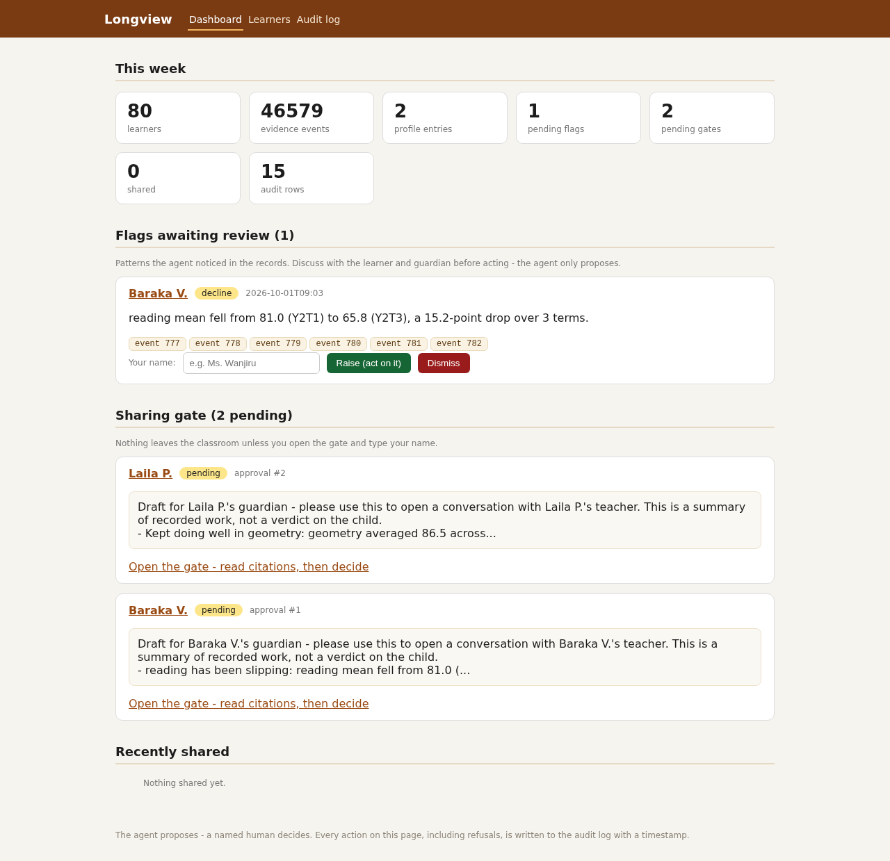
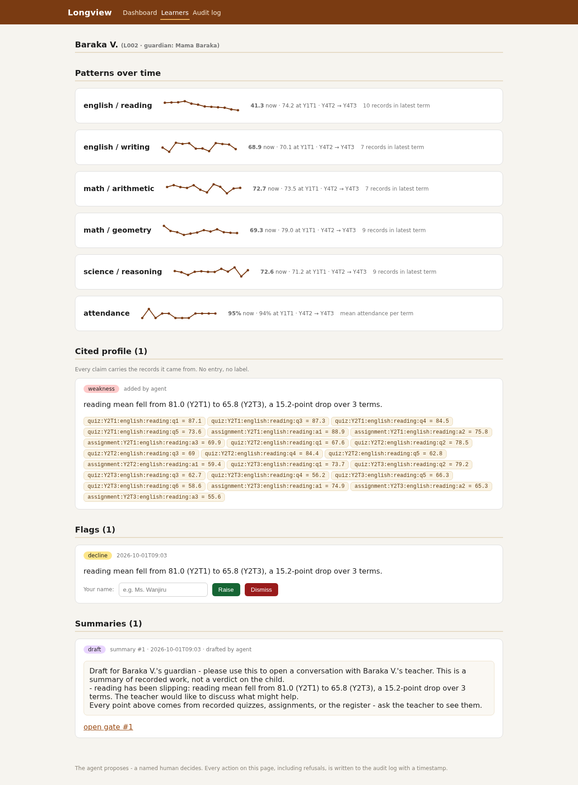
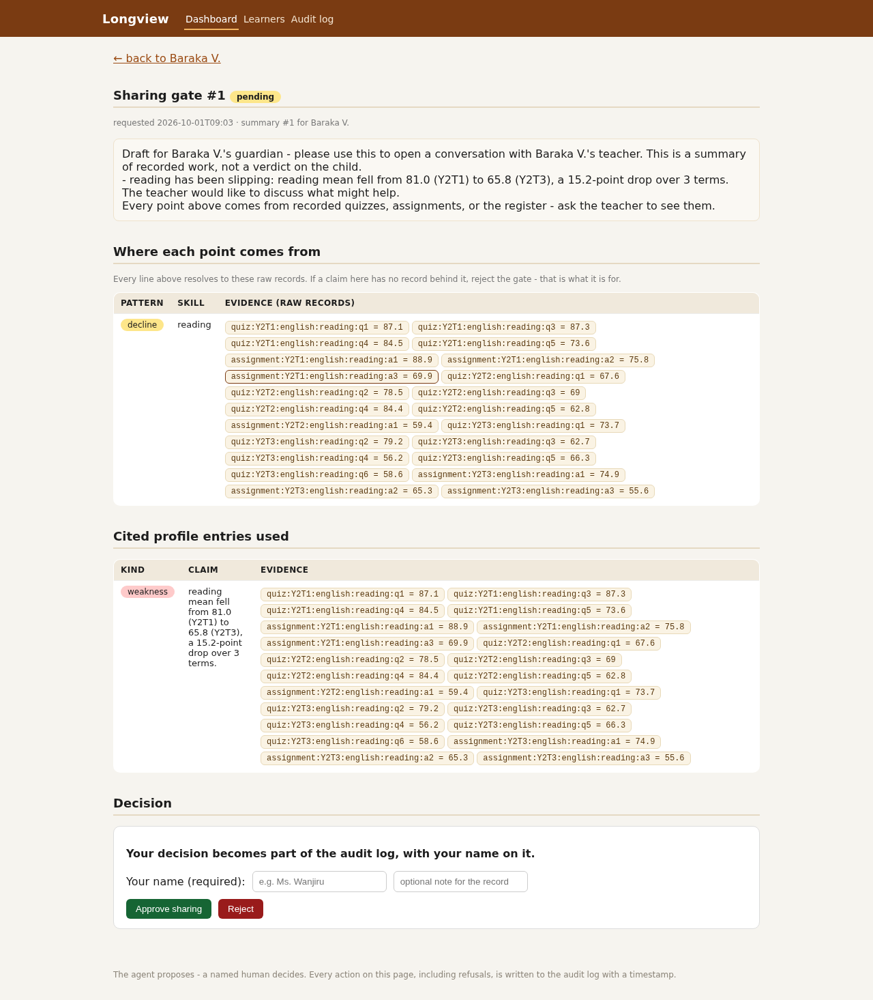
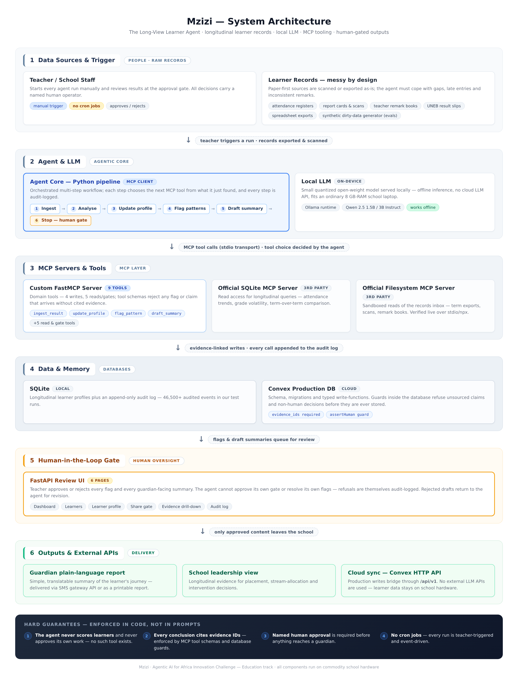

# Mzizi (Roots)

**Mzizi** is Swahili for *roots* — this project follows one learner across **years, not one
term**, so a teacher can act on a child's real trajectory instead of last term's average.
(Codename in the UI and code: *Longview*.)

**Track:** Education — Longitudinal strength tracking, Agentic AI for Africa Innovation Challenge.

Mzizi ingests the records a public school already has — attendance registers, quiz and
assignment results, teacher remark books, report cards, UNEB result slips, spreadsheet
exports — and turns them into a **running, cited learner profile**. Every strength or
weakness it claims carries the exact quiz, term, and score it came from. It never assigns
a track, never labels a child, and never shares anything outside the classroom without a
named human approving it first.

**Watch the demo (90 seconds):** [`docs/demo.mp4`](docs/demo.mp4)
**Browse the teacher review UI (read-only snapshot of a real run):** <https://tommlawrence.github.io/roots/>

| Dashboard | Learner profile | Share gate |
|---|---|---|
|  |  |  |

## Problem statement

A public-school teacher in Uganda meets 60–200 learners a year, but the records about
those learners are fragmented and messy: scores live in exercise books, attendance in a
register, remarks in a notebook, official results in UNEB slips, and whatever a spreadsheet
volunteer typed up last term. Each snapshot is only "this term, this subject". A learner
who has been quietly sliding in reading for three terms — or quietly excelling at geometry
for four years — is invisible, because nobody can see the trend across terms and subjects
in one place. By the time a problem surfaces in end-of-year results, the moment to help
has passed. Worse, when schools or NGOs do try to automate this, they reach for opaque
scoring models that label children ("weak student") with no receipt, which is unfair to
the child and unusable for a teacher who has to explain a decision to a parent.

## Solution overview

Mzizi is an **agentic AI that does the clerical work of longitudinal tracking** and stops
where a human must decide. It:

1. **Ingests** messy raw records (synthetic stand-ins for real school exports: missing
   rows, late logging, typos, duplicate notes, Kiswahili remarks, attendance gaps).
2. **Analyses** each learner's full history with deterministic longitudinal rules
   (declines including slow multi-term slides, sustained strengths, attendance risk).
3. **Proposes cited profile entries** — every claim must cite the exact raw records
   (evidence ids) it came from, and the data layer refuses unsourced claims.
4. **Raises patterns for teacher review** and **drafts plain-language guardian summaries**
   from cited facts only, using a local open-weights model (no cloud, no child data leaves
   the machine).
5. **Stops at a human gate**: nothing is shared and no flag becomes action until a named
   teacher approves it in the review UI — by typing their name on the record.

The teacher reviews everything in a 6-page web UI (dashboard, roster, learner profile,
share gate, evidence drill-down, audit log). The agent proposes; the human decides; the
audit log remembers both.

## Target users

- **Primary:** class teachers and headteachers in resource-constrained public schools
  (large classes, shared or personal 8 GB-RAM laptops, intermittent internet).
- **Secondary:** deputy heads / directors of studies reviewing patterns across a cohort,
  and school counsellors preparing parent conversations.
- **Indirect:** parents and guardians, who receive only plain-language summaries a human
  chose to send, and learners, who are described by receipts rather than labels.

## Architecture



Six layers, bottom-up in the diagram above:

1. **Data sources & triggers** — registers, report cards, remark books, UNEB slips,
   spreadsheet exports, dropped into `records_inbox/`. **No cron jobs anywhere**: runs are
   triggered by a teacher (CLI or dropping a file), never on a schedule.
2. **Agent + local LLM** — LangGraph pipeline over an open-weights model (Ollama,
   Qwen 2.5 3B Q4; falls back to a deterministic template drafter when no model is present).
3. **MCP layer** — our FastMCP server with 9 domain tools, plus the official Filesystem
   MCP server (sandboxed reads of `records_inbox/`) and the official SQLite MCP server
   (generic read-only SQL), wired in `mcp_config.json`.
4. **Data & memory** — local SQLite (raw events, cited profiles, flags, approvals,
   append-only audit log) for the classroom; Convex schema + typed write-functions as the
   production backend, enforcing the same rules at the database layer.
5. **Human gate** — the FastAPI teacher review UI; the agent cannot approve its own gate.
6. **Outputs** — guardian report (SMS gateway in production), leadership view, Convex
   HTTP bridge (`/api/v1`). No external LLM APIs are called with learner data.

## Agent architecture

`agent/graph.py` is a LangGraph state machine: **plan → ingest → analyse → propose →
draft → gate**. At each step the agent decides which MCP tool to call based on what the
previous step found (e.g. `analyse_learner` output drives which evidence ids go into
`update_profile` / `flag_pattern`); the steps are not hard-coded function calls. A
retry/recovery wrapper handles tool failures, and an `escalate` node routes anything
ambiguous to the human queue instead of guessing. The agent's autonomy is deliberately
bounded: it can read, ingest, analyse, propose, and draft — but `resolve_approval` and
flag decisions are human-only in code (`ensure_human` guard), and the share step is
blocked (`ApprovalRequiredError`) until a named human approves that exact summary.
Every tool call — including refusals — is appended to an immutable audit log.

## MCP implementation

- **Our server** (`longview_mcp/server.py`): FastMCP (Python), stdio transport
  (`LONGVIEW_TRANSPORT=http` for HTTP on `127.0.0.1:8100`). Tool logic lives in pure
  stdlib `core.py`; the server is a thin typed wrapper. Every tool call is audit-logged
  with actor, arguments, result, and timestamp.
- **The citation rule is schema-enforced, not prompted:** `update_profile` and
  `flag_pattern` take `evidence_ids: list[int]` as a required parameter and validate each
  id against the raw records database; empty or unknown ids raise `UnsourcedClaimError`
  and the refusal itself is written to the audit log.
- **Borrowed servers** are real integrations, not slides: `agent/inbox.py` reads
  `records_inbox/` exclusively through the official `@modelcontextprotocol/server-filesystem`
  (stdio via npx), so school files stay outside our attack surface; `mcp_config.json`
  wires all three servers for any MCP client.

## MCP tools/servers

**Ours — `longview` FastMCP server (9 tools):**

| Tool | Kind | Notes |
|---|---|---|
| `ingest_result` | write | Append one raw record (quiz / assignment / attendance / note) |
| `update_profile` | write | Add a cited strength/weakness/note; **refuses unsourced claims** |
| `flag_pattern` | write | Raise a pattern for review; `evidence_ids` required; never auto-sent |
| `draft_summary` | write | Plain-language draft from cited facts only (local LLM or template) |
| `get_learner_profile` | read/gate | Full profile; every entry carries its evidence records |
| `analyse_learner` | read/gate | Deterministic longitudinal analysis (decline, sustained strength, attendance risk) |
| `request_approval` | read/gate | Open a human gate for an irreversible action (e.g. `share_summary`) |
| `resolve_approval` | read/gate | **A named human** approves/rejects (done in the review UI) |
| `share_summary` | read/gate | Blocked unless a named human approved this exact summary |

**Borrowed (third-party, read-only):** official `server-filesystem` (sandboxed
`records_inbox/` reads; used by the inbox ingest path) and official `server-sqlite`
(generic audited SQL reads; configured in `mcp_config.json`). Why borrow: standard,
audited, zero code to maintain — and the boundary (what each server may touch) is
documented in `borrowed/README.md`.

## Human-in-the-loop workflow

1. Teacher drops a term export in `records_inbox/` (or runs `make agent`).
2. Agent ingests, analyses, proposes cited entries, raises flags, drafts a summary —
   then **requests a share gate and stops**.
3. Teacher opens **Dashboard → Sharing gate**, clicks through to the gate page, and reads
   the claims-to-evidence tables: every sentence of the draft is mapped to its raw records.
4. Teacher types **their own name** and approves — or rejects — the gate. An empty name is
   refused. The agent identity is hard-refused (and the refusal is audit-logged).
5. Only then does `share_summary` succeed, and the audit log shows who decided what, when.
   Flags work the same way one level up: raise → teacher reviews evidence → act or dismiss,
   with the agent barred from resolving its own flags.

There are **no scheduled jobs**: nothing happens without a teacher triggering it, so the
human gate cannot be bypassed by a timer.

## Technology stack

| Layer | Choice | Why |
|---|---|---|
| Language (agent/MCP/UI) | Python 3.12 | School ICT rooms and laptops already have it on Ubuntu |
| Agent orchestration | LangGraph | Explicit state machine with a real human-gate node |
| MCP | FastMCP (Python) + official Filesystem/SQLite servers | Standard protocol; borrowed infra stays standard |
| LLM | Ollama, Qwen 2.5 3B Instruct Q4 (1.5B fallback) | Open weights, offline, fits 8 GB RAM; template fallback needs no model |
| Review UI | FastAPI + uvicorn, server-rendered HTML | Zero client dependencies, runs on a school laptop |
| Classroom datastore | SQLite | One file, no server, easy backup on a USB stick |
| Production backend | Convex (TypeScript) | Typed write-functions enforce the citation + human-gate rules at the DB layer; `/api/v1` HTTP bridge |
| Testing/evals | pytest (43 tests) + custom eval runner (11 tasks × reps) | Honest pass/fail incl. known failures |

## Setup/installation instructions

**Tested on Ubuntu 24.04.x (Noble) with Python 3.12 and Node 18 — the distribution
defaults. Everything runs locally; no cloud account is needed for the prototype.**

```bash
# 1. System packages (Ubuntu 24.04.x)
sudo apt update
sudo apt install -y python3-venv python3-pip git ffmpeg curl nodejs npm

# 2. Clone and set up a virtual environment
git clone https://github.com/TommLawrence/roots.git
cd roots
python3 -m venv .venv
source .venv/bin/activate
pip install -e ".[dev]"

# 3. One command: generate the messy synthetic cohort, run the agent end-to-end
#    on one learner, and start the teacher review UI at http://localhost:8080
make demo
```

**Optional — the open-weights model** (the pipeline already runs without it, via a
deterministic template drafter):

```bash
curl -fsSL https://ollama.com/install.sh | sh          # Ubuntu installer
ollama pull qwen2.5:3b-instruct-q4_K_M                  # ~2.0 GB RAM footprint
cp .env.example .env                                    # defaults point at localhost:11434
```

**Optional — production backend:** `convex/` contains the schema, write-functions and
migrations; see `convex/README.md` for `npx convex dev`, data import
(`python -m scripts.export_for_convex`) and deployment steps.

## Usage instructions

| Command | What it does |
|---|---|
| `make demo` | Generate data → run agent end-to-end on one learner → start UI on :8080 |
| `make data` | Regenerate the synthetic cohort (`--seed 42 --learners 80`, ~46.5k events) |
| `make agent` | Run the agent on learner `L003` (tool-call trace printed for demo) |
| `make inbox` | Watch `records_inbox/` via the filesystem MCP server; newest export wakes the agent |
| `make ui` | Start the teacher review UI (`python -m ui.app --port 8080`) |
| `make evals` | 11 tasks × 3 reps, writes `evals/results/EVALS_REPORT.md` |
| `make test` | Run the 43 pytest cases |

**Review UI pages:** `/` dashboard (KPIs, flag queue, gate queue) · `/learners` roster ·
`/learner/{code}` cited profile with trends · `/gate/{id}` share gate with
claims-to-evidence tables · `/evidence?id=…` (or `?ref=…`) drill-down to the raw record ·
`/audit` append-only log. Approve/reject forms require typing your name; the share button
only appears once a gate is approved.

**Environment variables** (`.env.example`): `LONGVIEW_MODEL`, `LONGVIEW_LLM_BASE_URL`,
`LONGVIEW_LLM_PROVIDER`, `LONGVIEW_DB`, `LONGVIEW_ACTOR`.

## Testing & evaluation

- `make test` — **43 pytest cases**: citation integrity (no unsourced claims possible),
  pattern detection incl. no-false-positives, gate semantics (approve, reject, empty-name
  refusal, agent self-approval refusal), audit completeness, UI flows, inbox ingest.
- `make evals` — 11 task scenarios × repetitions on fresh cohorts. E01–E10 pass stably;
  **E11 is a documented known failure** (a Kiswahili typo note maps to `unknown_skill`)
  kept visible in `EVALS.md` with next steps rather than hidden.

## Limitations

- **All data is synthetic.** Real school records have never touched this codebase; the
  generator is deliberately messy, but real-world mess will be worse.
- **Single-school, single-machine scale.** SQLite is the classroom store; Convex is the
  production path but is not deployed to a cloud project yet (schema, guards, migrations
  and import script are ready and typechecked).
- **One known eval failure** (E11, Kiswahili typo → `unknown_skill`); Kiswahili/vernacular
  note handling is rudimentary.
- **SMS is stubbed.** `share_summary` records the intent and the approval trail; wiring to
  a real gateway (e.g. Africa's Talking) is production work.
- **The review UI is single-operator.** Designed for the class teacher's laptop; no
  multi-user auth yet, so it is not meant to be exposed publicly as-is.
- The LLM drafts summaries but is never trusted with the citation rule — that is data-layer
  law — and without a model it falls back to templates.

## Future improvements

- Wire the SMS gateway for real guardian delivery with delivery receipts into the audit log.
- Better Kiswahili/bilingual note understanding (the E11 failure is the concrete to-do).
- Deploy Convex, run the import + migrations on a real project, and move multi-school
  leadership views there.
- Multi-teacher accounts and roles in the review UI (deputy head vs class teacher).
- Map detected skills to the national curriculum codes so reports speak the school's language.
- Structured teacher-interview findings (the classroom-fit template in `docs/teacher_interview.md`)
  feeding a second design iteration.

## Data & privacy

All data in this repository is **synthetic**, generated by `datagen/`. No real learner
records exist anywhere in the repo or its history. The architecture is privacy-first by
design: local LLM, local storage, nothing leaves the classroom without a named human's
approval, and every share is auditable end-to-end.

## Repository map

| Path | What it is |
|---|---|
| `datagen/` | Synthetic cohort generator — realistically messy |
| `longview_mcp/` | **Our MCP server** — `core.py` (pure stdlib logic), `server.py` (FastMCP), patterns, LLM client |
| `agent/` | LangGraph agent + CLI runner (`python -m agent.run --learner L003`; `--from-inbox`) |
| `records_inbox/` | Where the school drops term exports; read **only** via the borrowed filesystem MCP server |
| `mcp_config.json` | Client config wiring all three MCP servers |
| `borrowed/` | The two MCP servers we did **not** write, and the boundary table |
| `ui/` | Teacher review UI (FastAPI) — the human gate, visible |
| `convex/` | Production backend: schema, guarded write-functions, migrations, `/api/v1` bridge |
| `evals/` | 11 task scenarios, runner, honest report incl. one known failure |
| `tests/` | 43 pytest cases |
| `docs/` | This demo: `demo.mp4`, `architecture.png`, `screenshots/`, teacher interview template, demo script |
| `scripts/export_for_convex.py` | SQLite → camelCase JSONL export (verified on 46.5k events) |

## Licence

MIT (OSI-approved).
